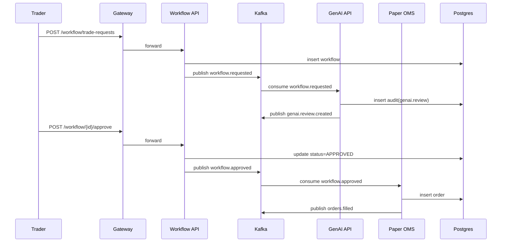

# Architecture (C4 + flux)

## Vue d’ensemble (C2)
- API Gateway (Kong) : auth/rate-limit/routing (analogue API Management)
- Kafka compatible (Redpanda) : bus d’événements
- Postgres : états (workflows, orders, audit)
- Services :
  - Market Data API
  - Signal Engine (worker)
  - Risk Service (worker)
  - Workflow Orchestrator API
  - Paper OMS (worker)
  - GenAI Service API (RAG + LLM provider)
  - Notifier (worker)

## Flux principal “Trade Request”
1. Trader crée une demande (`workflow-api`)
2. `genai-service` produit une **revue** (RAG + LLM) et log l’audit
3. Approbations (Risk/Compliance) via API (human-in-the-loop)
4. `paper-oms` exécute en paper et publie `orders.filled`
5. `audit` centralisé

## Schémas (Mermaid)

