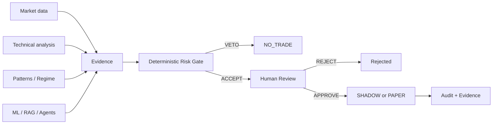

# 01 — Vision d’architecture et principes directeurs

## 1. Pourquoi TradeOps existe

TradeOps est un **portfolio d’architecture exécutable**. Son but n’est pas de produire un robot de trading réel, mais de démontrer comment concevoir une plateforme moderne combinant :

- temps réel et event-driven architecture ;
- calculs déterministes ;
- Machine Learning ;
- GenAI et RAG ;
- agents spécialisés ;
- accès gouverné aux outils via MCP ;
- Human-in-the-Loop ;
- OpenShift/GitOps ;
- observabilité, sécurité, résilience, FinOps et GreenOps.

Le trading est utilisé comme domaine de référence parce qu’il impose des contraintes fortes : fraîcheur des données, explicabilité, latence, contrôle du risque, audit et interdiction d’exécuter une décision incertaine.

## 2. Mission architecturale

La mission du système est de transformer plusieurs formes de preuves en une décision gouvernée :

## 3. Principes non négociables

### 3.1 Déterministe avant probabiliste

Les éléments qui peuvent être calculés exactement doivent rester déterministes : indicateurs, géométrie entry/stop/target, règles de risque, freshness, permissions, transitions d’état.

Le ML et la GenAI enrichissent la décision, mais ne remplacent pas ces contrôles.

### 3.2 Un score ML n’est pas automatiquement une probabilité

Un score n’est appelé probabilité que lorsqu’une calibration réelle hors échantillon le justifie. Les sorties synthétiques ou `SCORE_ONLY` restent informatives.

### 3.3 Le Risk Gate garde le veto

Aucun agent, aucun LLM et aucun vote majoritaire ne peut convertir un `VETO` déterministe en autorisation.

### 3.4 Human-in-the-Loop avant exécution

Un setup éligible devient `REVIEW_REQUIRED`, jamais directement `APPROVED`. Le reviewer humain reste une frontière de contrôle explicite.

### 3.5 Fail closed

En cas de donnée périmée, preuve contradictoire, erreur d’autorisation, risque non évalué ou état invalide, la plateforme doit refuser ou dégrader la décision plutôt que poursuivre implicitement.

### 3.6 Evidence before claims

On ne marque une capacité `LIVE` qu’après preuve runtime. Git, tests ou CI prouvent l’implémentation, pas le fonctionnement réel dans un environnement donné.

### 3.7 Trading comme référence, architecture comme produit

Les composants sont conçus pour être transposables :

| TradeOps | Paiements / Banque | Assurance | Cybersécurité |
|---|---|---|---|
| Market event | Payment event | Claim event | Security event |
| Signal | Fraud/risk signal | Claim score | Threat score |
| Risk Gate | Payment controls | Eligibility rules | Policy engine |
| HITL reviewer | Fraud analyst | Underwriter | SOC analyst |
| Paper execution | Sandbox/payment simulation | Claim simulation | Response simulation |

## 4. Qualités architecturales recherchées

- **Auditabilité** : toute décision importante doit être traçable.
- **Explicabilité** : séparer faits, scores, règles et décision humaine.
- **Sécurité** : moindre privilège, segmentation réseau, secrets hors frontend.
- **Résilience** : composants stateless redémarrables, persistance explicitement gérée.
- **Portabilité** : logique identique de CRC vers ARO.
- **Observabilité** : health, metrics, traces, dashboards et preuves.
- **Sobriété** : éviter les ressources permanentes inutiles, mesurer coûts et empreinte lorsque possible.

## 5. Frontières du système

### Dans le périmètre

- analyse ;
- signaux ;
- replay/backtesting ;
- scoring ML qualifié ;
- RAG et orchestration agentique ;
- Risk Gate ;
- HITL ;
- SHADOW/PAPER ;
- observabilité ;
- OpenShift/GitOps ;
- architecture Azure/ARO cible.

### Hors périmètre

- ordre réel automatisé ;
- recommandation financière personnalisée ;
- contournement du reviewer ;
- exposition publique directe de bases de données ou du MCP ;
- déclaration de performance réelle à partir des données synthétiques.

## 6. Statuts d’architecture

Le Wiki sépare volontairement quatre dimensions :

1. **concept décrit** ;
2. **code implémenté** ;
3. **CI validée** ;
4. **runtime prouvé**.

Une architecture professionnelle doit rendre ces différences visibles au lieu de les mélanger.
