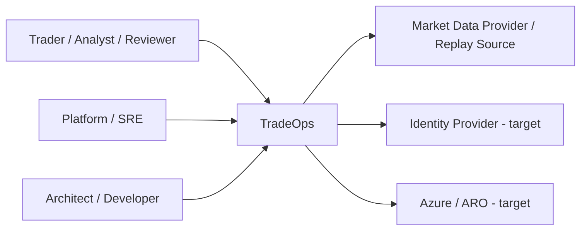
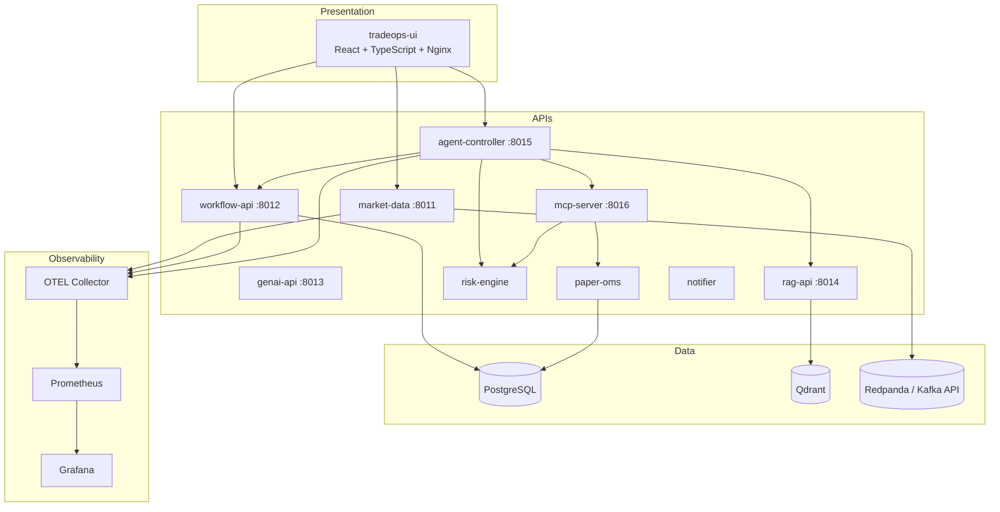
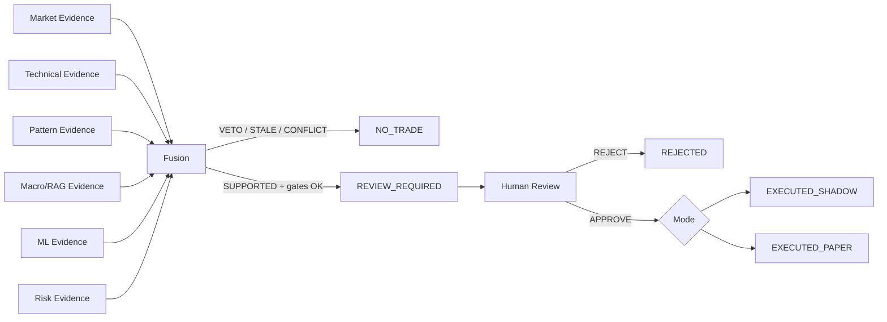
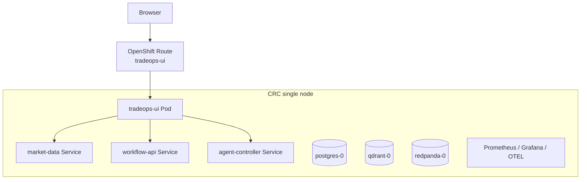

# 02 — C4 et architecture logique

Cette page fournit les vues C4 essentielles : contexte, conteneurs logiques et déploiement.

## 1. C4 — System Context

### Acteurs

- **Analyst** : consulte marché, signal et preuves.
- **Reviewer** : approuve/rejette les propositions éligibles.
- **SRE/Platform** : supervise OpenShift, métriques, traces et incidents.
- **Architect/Developer** : fait évoluer contrats, règles, modèles, manifests et evidence.

## 2. C4 — Container view

## 3. Responsabilités logiques

### Presentation

Le Web Cockpit présente le contexte métier et appelle uniquement trois backends autorisés via un reverse proxy same-origin. Il ne parle jamais directement à PostgreSQL, Redpanda, Qdrant ou MCP.

### Decision plane

`agent-controller` agrège les preuves et orchestre la décision, mais l’autorité finale reste distribuée :

- calculs déterministes dans les moteurs dédiés ;
- Risk Gate avec veto ;
- reviewer humain pour l’approbation ;
- Paper OMS pour l’exécution simulée.

### Knowledge plane

Le RAG apporte du contexte documentaire via Qdrant. Il ne devient pas une source d’autorité métier : une information récupérée peut être `UNKNOWN`, `CONFLICT` ou rejetée par la gouvernance RAG.

### Event plane

Redpanda fournit un bus Kafka compatible pour découpler la production et la consommation d’événements. Le bus transporte des faits/événements ; il ne doit pas devenir une base transactionnelle de substitution.

### Control plane

OpenShift, Helm, GitOps/Argo CD, NetworkPolicies, quotas, secrets, probes et observabilité constituent le plan de contrôle technique.

## 4. Architecture logique de décision

## 5. Vue de déploiement CRC

Le CRC est un environnement de preuve mono-nœud. Il ne démontre pas une haute disponibilité de production ; il démontre la cohérence du packaging et du comportement applicatif.

## 6. Frontières de confiance

1. **Browser → UI** : frontière utilisateur.
2. **UI → APIs** : frontière applicative contrôlée par proxy et NetworkPolicy.
3. **Agent Controller → MCP** : frontière d’outillage gouvernée.
4. **MCP → Risk/OMS** : frontière d’action avec scopes.
5. **Reviewer → execution** : frontière humaine obligatoire.
6. **Namespace → infrastructure** : frontière OpenShift/RBAC/Secret/NetworkPolicy.

Ces frontières doivent rester visibles dans toute évolution vers Azure/ARO.
