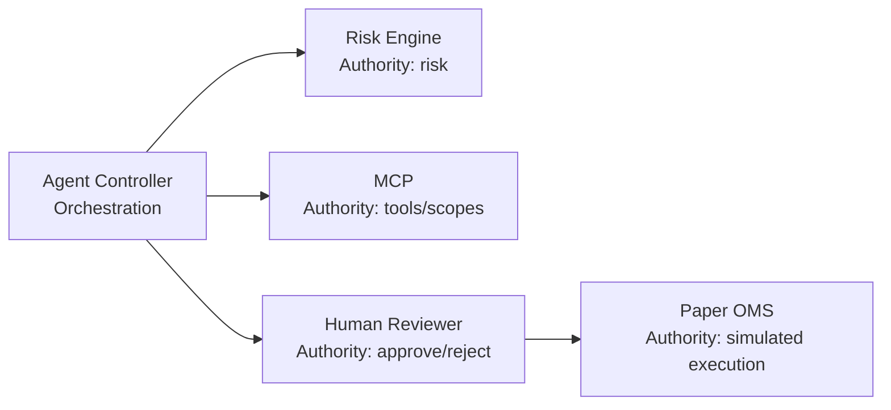

# 03 — Architecture applicative et services

## 1. Principe de découpage

TradeOps découpe les responsabilités par capacité métier/technique. Le but n’est pas de créer des microservices pour eux-mêmes, mais d’isoler les zones qui ont des contraintes de données, de sécurité, d’évolutivité ou de gouvernance différentes.

## 2. Catalogue des composants

| Composant | Port | Responsabilité | Données principales |
|---|---:|---|---|
| `market-data` | 8011 | données marché, replay, contexte | OHLC/market events |
| `workflow-api` | 8012 | workflow, état, audit | workflows/audit |
| `genai-api` | 8013 | revue GenAI gouvernée | prompts/réponses qualifiées |
| `rag-api` | 8014 | retrieval documentaire | passages + provenance |
| `agent-controller` | 8015 | agents, fusion, décision, HITL | evidence/proposals |
| `mcp-server` | 8016 | frontière d’outils gouvernée | tool calls/audit |
| `risk-engine` | interne | règles de risque déterministes | risk decision |
| `paper-oms` | interne | simulation d’exécution | paper orders/outcomes |
| `notifier` | interne | notification | événements opérationnels |
| `tradeops-ui` | 8080 | cockpit métier | données agrégées via API |
| PostgreSQL | 5432 | persistance transactionnelle/audit | workflows/orders/logs |
| Qdrant | 6333 | vector store | embeddings/chunks |
| Redpanda | 9092 | event bus Kafka compatible | événements |

## 3. Règle de propriété

Chaque composant doit avoir une responsabilité claire :

- `market-data` possède la lecture/normalisation/replay du marché ;
- `workflow-api` possède l’état du workflow et l’audit associé ;
- `rag-api` possède le retrieval, pas la décision ;
- `agent-controller` orchestre, mais n’a pas le droit d’abolir les règles déterministes ;
- `risk-engine` possède les contrôles durs ;
- `paper-oms` simule l’exécution, sans argent réel ;
- `tradeops-ui` présente et déclenche des opérations autorisées, sans devenir un backend caché.

## 4. Sync vs Async

### Appels synchrones

Utilisés lorsqu’une réponse immédiate est requise : health, lecture d’un workflow, assessment agentique, proposition/review/execute, retrieval RAG.

### Événements asynchrones

Utilisés pour découpler les producteurs/consommateurs, permettre replay, audit et traitement indépendant. Le contrat AsyncAPI sous `docs/asyncapi.yaml` documente ce plan event-driven.

## 5. Données transactionnelles vs analytiques

PostgreSQL est utilisé pour les éléments nécessitant cohérence transactionnelle et recherche par identifiant : workflows, décisions, orders simulés, audit.

Qdrant est spécialisé pour la similarité vectorielle. Il ne remplace pas PostgreSQL.

Redpanda est spécialisé pour le transport/replay d’événements. Il ne remplace ni PostgreSQL ni Qdrant.

## 6. Contrats d’API

Les APIs doivent exposer :

- `/health` pour la disponibilité fonctionnelle ;
- `/metrics` lorsque pertinent ;
- modèles Pydantic/JSON explicites ;
- codes d’erreur fail-closed ;
- identifiants de corrélation/workflow lorsque nécessaire.

Le `agent-controller` expose notamment :

- assessment ;
- proposition ;
- consultation d’une décision ;
- review humaine ;
- execution gouvernée ;
- endpoint autonome volontairement désactivé.

## 7. Séparation orchestration / autorité

Une distinction importante : **orchestrer ne signifie pas avoir l’autorité**.

Cette séparation réduit le blast radius d’une erreur d’agent ou de modèle.

## 8. Evolution et scalabilité

Les composants stateless peuvent évoluer horizontalement plus facilement. Les composants stateful (PostgreSQL, Qdrant, Redpanda) nécessitent une stratégie distincte de stockage, sauvegarde, réplication et RPO/RTO en production.

Le CRC mono-nœud prouve le packaging ; la cible ARO doit traiter la haute disponibilité, les zones de disponibilité et les services managés lorsqu’ils sont justifiés.

## 9. Critères pour créer un nouveau service

Créer un nouveau service seulement si au moins une raison forte existe :

- cycle de vie indépendant ;
- scaling différent ;
- boundary sécurité ;
- responsabilité métier cohérente ;
- technologie ou persistance réellement distincte.

Sinon, préférer un module interne pour éviter le **distributed monolith**.
