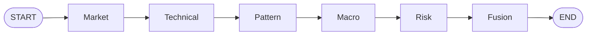
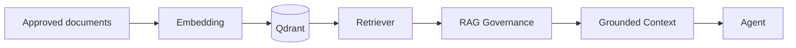
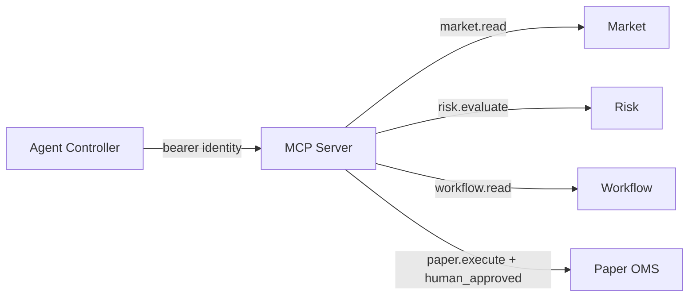

# 04 — Agentic AI, RAG et MCP

## 1. Qu’est-ce qu’un agent dans TradeOps ?

Un agent est un composant qui **interprète des preuves dans un rôle spécialisé** et contribue à une décision orchestrée. Il ne doit pas recalculer ce qui appartient aux moteurs déterministes ni s’auto-attribuer des permissions.

Les spécialistes implémentés sont :

- Market Agent ;
- Technical Agent ;
- Pattern Agent ;
- Macro Agent ;
- Risk Agent ;
- Fusion Agent.

## 2. Orchestration LangGraph

L’orchestration utilise un `StateGraph` :

Le graphe fournit un état explicite et testable. Dans l’itération de référence, son comportement est volontairement déterministe afin de tester les conflits sans dépendre d’un LLM.

## 3. Etats de preuve

Une preuve spécialiste n’est pas un simple `true/false`. TradeOps utilise des états explicites :

- `SUPPORTED` : preuve acceptable et cohérente ;
- `UNKNOWN` : information insuffisante ;
- `DATA_STALE` : donnée trop ancienne ;
- `CONFLICT` : contradiction ou contenu non fiable ;
- `VETO` : interdiction dure.

La priorité de fusion est fail-closed : VETO puis stale puis conflict puis opposition de preuves puis insuffisance ; `SUPPORTED` n’est possible qu’après alignement et risque déterministe acceptable.

## 4. RAG — Retrieval-Augmented Generation

Le RAG sépare la **connaissance externe récupérée** de la logique du modèle.

### Pourquoi RAG ?

- injecter procédures, politiques et runbooks versionnés ;
- obtenir une provenance ;
- réduire la dépendance à la mémoire paramétrique d’un modèle ;
- modifier la connaissance sans réentraîner un LLM.

### Ce que RAG ne garantit pas

RAG ne transforme pas automatiquement un texte en vérité. Le contenu peut être faux, obsolète, mal classé ou malveillant.

## 5. Gouvernance RAG

Avant qu’un passage récupéré entre dans le contexte agentique, TradeOps contrôle notamment :

- type de source approuvé (`.md` / `.txt`) ;
- plage et seuil de score ;
- texte non vide et borné ;
- marqueurs de prompt injection.

Une instruction suspecte peut produire `CONFLICT`. Aucun passage acceptable produit `UNKNOWN`.

## 6. MCP — Model Context Protocol comme frontière d’outils

Dans cette architecture, MCP n’est pas un raccourci pour « donner accès à tout ». Il représente une **frontière d’outillage gouvernée**.

## 7. Autorisation côté serveur

Le serveur mappe les tokens vers des principals et scopes côté serveur. Le client ne peut pas simplement envoyer `scope=paper.execute` pour obtenir un privilège.

Scopes généraux :

- `market.read` ;
- `risk.evaluate` ;
- `workflow.read`.

Scopes reviewer supplémentaires :

- `audit.read` ;
- `paper.execute`.

`oms.place_order` exige en plus `human_approved=true`.

## 8. Sécurité des tool calls

La frontière d’outils doit :

- refuser les tools inconnus ;
- valider arguments/enums/types ;
- limiter le débit ;
- appliquer des timeouts ;
- journaliser ;
- masquer les champs ressemblant à des secrets ;
- empêcher un agent général de devenir reviewer.

## 9. Agentic AI : ce qu’il faut retenir en entretien

Un système agentique d’entreprise ne se résume pas à « plusieurs prompts ». Il faut expliciter :

1. état partagé ;
2. rôles et responsabilités ;
3. outils disponibles ;
4. limites d’autorité ;
5. gestion des conflits ;
6. contrôle du risque ;
7. identité ;
8. audit ;
9. observabilité ;
10. intervention humaine.

TradeOps matérialise ces dix dimensions.
