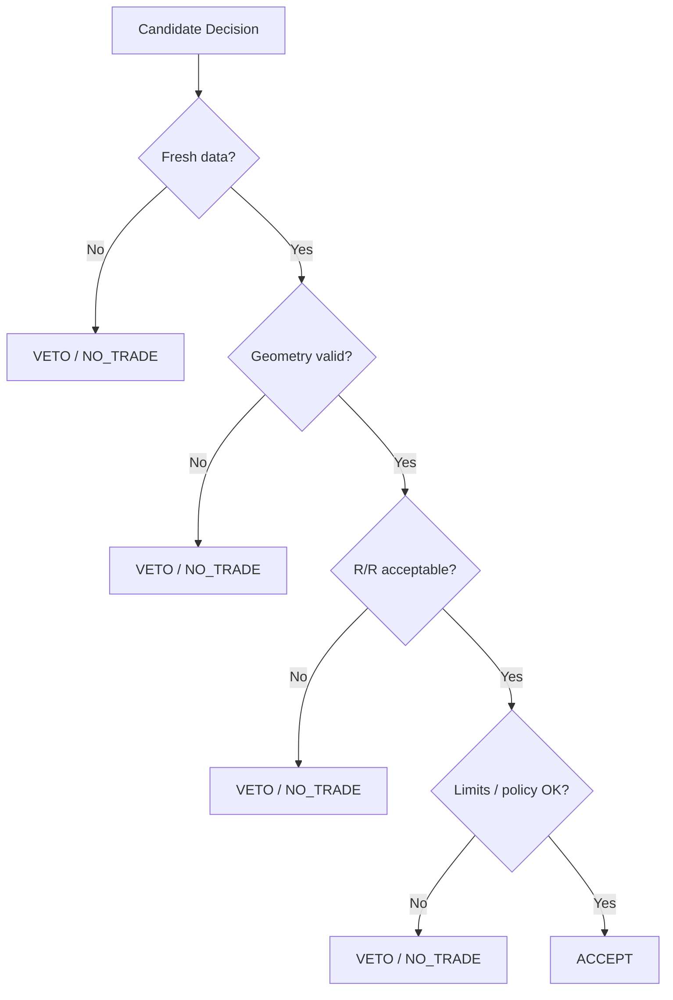
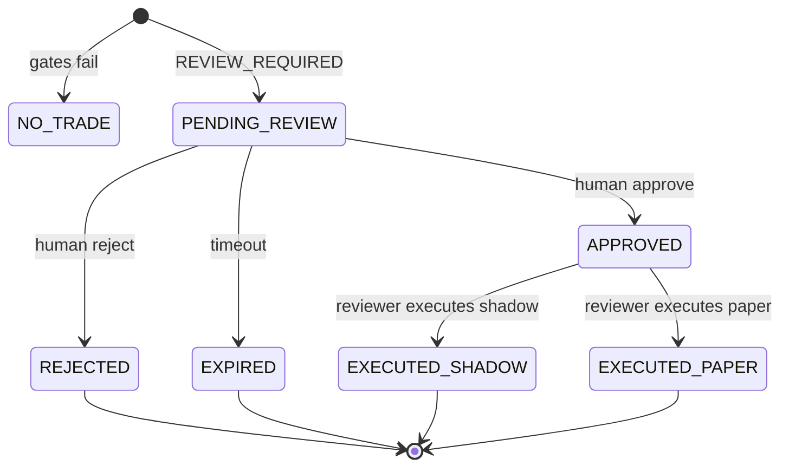

# 05 — Risk Gate, Decision Fusion et Human-in-the-Loop

## 1. Pourquoi séparer la fusion du risque ?

La fusion répond à la question : **les preuves convergent-elles suffisamment pour proposer une action ?**

Le Risk Gate répond à une autre question : **même si les preuves convergent, cette action est-elle autorisée par les règles de risque ?**

Mélanger ces deux fonctions rendrait un modèle ou une heuristique capable d’affaiblir une règle dure.

## 2. Fusion déterministe

La politique de fusion est gate-based. Elle n’utilise pas de majorité simple entre agents.

Gates typiques :

- assessment I6 `SUPPORTED` ;
- risque déterministe `ACCEPT` ;
- données fraîches ;
- qualité de preuve suffisante ;
- régime explicitement autorisé ;
- ratio Risk/Reward minimal ;
- historique suffisant ;
- expectancy historique acceptable ;
- géométrie entry/stop/target valide ;
- probabilité ML uniquement si réellement qualifiée/calibrée.

Si tous les gates sont satisfaits, le résultat devient **`REVIEW_REQUIRED`**, jamais `APPROVED`.

## 3. Risk Gate



Le principe est **policy enforcement point** : le Risk Gate n’explique pas seulement le risque, il peut empêcher la suite.

## 4. Lifecycle HITL



Contraintes :

- review unique ;
- execution unique ;
- case expiré = fail closed ;
- risque réévalué/acceptable au moment critique ;
- le mode réel n’existe pas dans le contrat de démonstration.

## 5. Séparation des identités

### Agent

Peut proposer une décision mais ne dispose pas de l’autorité d’exécution paper.

### Reviewer

Peut approuver/rejeter puis exécuter SHADOW/PAPER si les conditions restent valides.

Cette séparation est un exemple de **segregation of duties**.

## 6. Audit métier

Les événements d’audit incluent :

- `decision.proposed` ;
- `decision.reviewed` ;
- `decision.executed`.

Le `workflow_id` relie proposition, revue, exécution simulée et audit.

## 7. SHADOW vs PAPER

### SHADOW

Enregistre ce que le système aurait exécuté après validation humaine, sans appeler l’OMS d’exécution.

### PAPER

Effectue une simulation d’ordre via le Paper OMS. Aucun ordre réel n’est transmis à un broker.

## 8. Pourquoi le HITL est architectural, pas seulement UX

Le HITL implique :

- état persistant ;
- identité/roles ;
- autorisations distinctes ;
- expirations ;
- idempotence ;
- audit ;
- UI de revue ;
- preuves de décision ;
- séparation proposition/exécution.

Un simple bouton « Approve » sans ces propriétés n’est pas un vrai pattern HITL d’entreprise.

## 9. Etat de preuve CRC

La plateforme et le cockpit sont LIVE sur CRC. Le workflow HITL est implémenté et testé, mais la preuve runtime complète du parcours :

```text
REVIEW_REQUIRED -> APPROVE/REJECT -> SHADOW/PAPER -> audit
```

reste à capturer avant de le déclarer `LIVE VERIFIED` de bout en bout.
