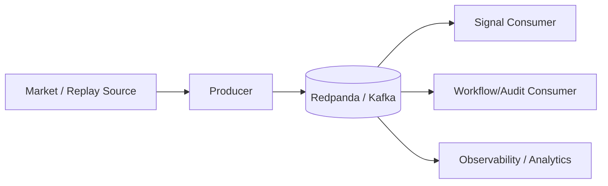
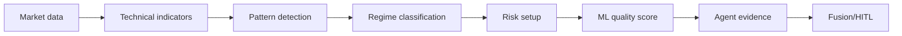

# 06 — Event-Driven Architecture, Data, ML, Replay et Backtesting

## 1. Pourquoi une architecture event-driven ?

Un système temps réel traite des faits qui arrivent continuellement : nouvelle bougie, nouveau prix, changement de régime, décision proposée, revue humaine, exécution simulée.

L’EDA permet de découpler production et consommation :

Avantages :

- découplage ;
- capacité de replay ;
- scalabilité indépendante ;
- traitement asynchrone ;
- meilleure traçabilité temporelle.

## 2. Concepts Kafka appliqués

### Topic

Flux logique d’événements de même famille.

### Partition

Unité de parallélisme et d’ordre local. L’ordre global entre partitions ne doit pas être supposé.

### Consumer group

Plusieurs consommateurs coopèrent pour traiter un topic sans dupliquer le travail dans un même groupe.

### Offset

Position d’un consommateur dans le flux. Il permet reprise et replay.

### Idempotence

Un événement peut être reçu plus d’une fois. Les handlers doivent éviter de produire plusieurs effets métier pour le même événement logique.

## 3. Architecture Data

TradeOps sépare les usages :

| Technologie | Rôle | Ne doit pas devenir |
|---|---|---|
| PostgreSQL | état transactionnel, workflow, audit | vector DB |
| Qdrant | recherche vectorielle/RAG | base transactionnelle |
| Redpanda | transport/replay d’événements | base métier primaire |
| fichiers/corpus | jeux de données et evidence versionnés | stockage runtime secret |

Cette séparation est un principe de **polyglot persistence raisonnée**.

## 4. Pipeline de signal

Les étapes déterministes restent séparées du ML afin de conserver explicabilité et reproductibilité.

## 5. ML : rôle et limites

Le ML sert à estimer la **qualité d’un signal** à partir de features. Il ne doit pas :

- remplacer les règles de risque ;
- être présenté comme probabilité sans calibration ;
- être entraîné et évalué sur les mêmes données ;
- utiliser des informations futures (data leakage).

Le dépôt utilise des bibliothèques classiques comme scikit-learn, XGBoost et LightGBM, avec une discipline d’évaluation distincte des sorties GenAI.

## 6. Dataset, features, label

- **Feature** : information disponible au moment de la décision.
- **Label** : résultat futur utilisé pour apprendre/évaluer.
- **Dataset train** : apprend les paramètres.
- **Validation/test** : mesure la généralisation.

Toute feature calculée avec une information postérieure au timestamp de décision introduit du leakage.

## 7. Calibration

Un modèle peut classer correctement sans produire des probabilités fiables. La calibration mesure si, par exemple, les cas annoncés à 70 % réussissent réellement environ 70 % du temps sur données appropriées.

TradeOps distingue donc score et probabilité qualifiée.

## 8. Replay, Backtest, Shadow, Paper

| Mode | Données | Décision | Exécution |
|---|---|---|---|
| Replay | historique rejoué | logique actuelle | aucune |
| Backtest | historique | stratégie évaluée | simulée historiquement |
| Shadow | live/replay | décision complète | enregistrée sans ordre |
| Paper | live/replay | décision complète | ordre simulé |
| Real | live | décision | **hors scope** |

## 9. Backtesting discipliné

Un backtest crédible doit documenter :

- période ;
- univers/instrument ;
- timeframe ;
- règles d’entrée/sortie ;
- coûts/slippage simulés si pertinents ;
- taille de l’échantillon ;
- séparation in-sample/out-of-sample ;
- drawdown ;
- expectancy ;
- provenance du dataset.

Les résultats synthétiques ne sont pas présentés comme performance financière réelle.

## 10. Evidence Paper/Shadow

Le projet a déjà produit un jeu de 100 outcomes SHADOW/PAPER pour satisfaire un gate de preuve. Cette evidence valide la mécanique et la discipline d’outcomes ; elle ne constitue pas une promesse de performance.

## 11. Transposition entreprise

Le même pattern s’applique à :

- paiements : événement paiement -> règles -> score fraude -> revue -> action ;
- assurance : événement sinistre -> règles -> score -> underwriter ;
- cyber : alerte -> enrichissement -> risk policy -> analyste SOC -> réponse contrôlée.
