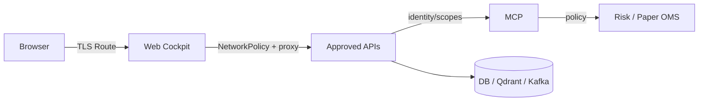

# 07 — Architecture sécurité et Zero Trust

## 1. Modèle de sécurité

TradeOps applique un principe simple : **aucune confiance implicite basée sur le réseau, le composant ou le fait qu’un appel provient d’un agent IA**.

Le contrôle repose sur plusieurs couches : identité, autorisation, segmentation réseau, validation des entrées, secrets, audit et fail-closed.

## 2. Trust boundaries



Le navigateur n’accède pas directement au plan de données interne.

## 3. Segmentation réseau OpenShift

Le namespace applique un `default-deny`. Des NetworkPolicies ajoutent uniquement les flux nécessaires :

- DNS ;
- ingress du routeur vers les composants exposés ;
- flux backend internes autorisés ;
- egress HTTPS externe pour les composants qui en ont besoin ;
- règles spécifiques au build OpenShift ;
- policy dédiée `tradeops-ui` vers les seuls backends Market/Workflow/Agent.

Le principe est : **deny by default, allow by exception**.

## 4. Secrets

Les secrets runtime sont injectés via Secret OpenShift. Le frontend ne compile pas les tokens Agent/Reviewer et ne les persiste pas dans un stockage navigateur durable.

A ne jamais faire :

- commit d’un secret dans Git ;
- secret dans `VITE_*` ou JavaScript livré au navigateur ;
- mot de passe dans ConfigMap ;
- token imprimé dans evidence publique.

## 5. AuthN vs AuthZ

- **Authentication (AuthN)** : qui es-tu ?
- **Authorization (AuthZ)** : qu’as-tu le droit de faire ?

Un token valide ne donne pas tous les droits. Le rôle Agent et le rôle Reviewer disposent de scopes différents.

## 6. Separation of Duties

La proposition et l’exécution ne doivent pas appartenir au même principal logique.

```text
Agent -> propose
Reviewer -> approve/reject
Reviewer + approved case -> SHADOW/PAPER execute
```

Cette séparation limite l’impact d’un agent compromis ou halluciné.

## 7. Sécurité RAG / Prompt Injection

Le RAG ajoute une nouvelle surface d’attaque : un document peut contenir une instruction conçue pour détourner l’agent.

Mesures :

- corpus approuvé ;
- filtrage type/taille ;
- score minimum ;
- détection de marqueurs d’injection ;
- provenance ;
- aucune instruction RAG ne peut contourner une règle de risque ou un contrôle d’identité.

## 8. Sécurité des outils MCP

Le serveur MCP :

- mappe l’identité côté serveur ;
- refuse tools/arguments inconnus ;
- valide types/enums ;
- applique rate limits et timeouts ;
- masque les secrets dans l’audit ;
- exige `human_approved=true` pour l’action paper critique.

## 9. Sécurité Web

Nginx ajoute des headers :

- Content-Security-Policy ;
- `X-Frame-Options` ;
- `X-Content-Type-Options: nosniff` ;
- Referrer Policy ;
- Permissions Policy.

Le reverse proxy same-origin réduit l’exposition des services internes et simplifie la politique navigateur.

## 10. Threat model résumé

| Menace | Contrôle |
|---|---|
| prompt injection | RAG governance + tool isolation |
| agent overreach | scopes + Risk Gate + HITL |
| secret leak | OpenShift Secret + redaction |
| lateral movement | NetworkPolicies/default-deny |
| replay/double execution | workflow states + idempotence |
| stale market data | freshness gate |
| malicious UI input | validation API/server-side |
| direct DB access | services internal-only |
| autonomous real order | absence de real execution + disabled endpoint |

## 11. Cible production

Les static bearer tokens sont adaptés au laboratoire CRC, pas à la production. La cible prévoit OIDC/fédération d’identité, RBAC et intégration avec le modèle d’identité Azure/OpenShift.
