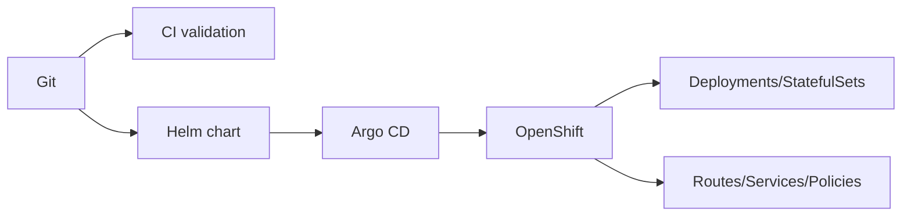
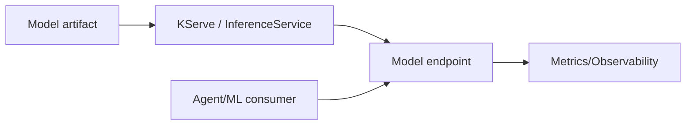

# 08 — OpenShift, CRC, GitOps et OpenShift AI

## 1. Pourquoi OpenShift ?

OpenShift apporte Kubernetes avec une plateforme d’entreprise intégrant sécurité, registry, build, routing, opérateurs, RBAC et politiques adaptées aux environnements réglementés.

Dans TradeOps, OpenShift sert de **runtime de référence**, d’abord localement avec CRC puis comme cible managée Azure Red Hat OpenShift.

## 2. Concepts Kubernetes/OpenShift utilisés

| Concept | Rôle dans TradeOps |
|---|---|
| Namespace | isolation logique `tradeops` |
| Deployment | services stateless |
| StatefulSet | PostgreSQL, Redpanda, Qdrant |
| Service | découverte réseau interne |
| Route | exposition HTTP(S) contrôlée |
| ConfigMap | configuration non secrète |
| Secret | credentials/tokens |
| ResourceQuota | plafond namespace |
| LimitRange | défauts/limites containers |
| NetworkPolicy | segmentation L3/L4 |
| ImageStream | référence d’image OpenShift |
| BuildConfig | build d’image dans OpenShift |
| SCC | contraintes sécurité runtime |

## 3. Packaging

TradeOps utilise Helm pour décrire les workloads et valeurs par environnement.



## 4. CRC — rôle et limites

CRC/OpenShift Local fournit un cluster mono-nœud adapté au développement et aux preuves d’architecture.

Ce que CRC prouve :

- manifests/Helm valides ;
- comportement réseau ;
- images compatibles OpenShift ;
- Routes ;
- probes ;
- Secrets ;
- NetworkPolicies ;
- intégration des services.

Ce que CRC ne prouve pas :

- HA multi-nœuds ;
- tolérance à une panne de zone ;
- performances production ;
- DR inter-région ;
- coût Azure réel.

## 5. Etat CRC vérifié

Le Web Cockpit est LIVE avec :

- Deployment `tradeops-ui` Ready ;
- Service port 8080 ;
- Route edge TLS ;
- health/proxy HTTP 200 ;
- `I9_CRC_VERIFY_PASS`.

Les principaux backends et les StatefulSets sont également Running.

## 6. Build OpenShift

Deux images sont séparées :

```text
tradeops-runtime:i9
tradeops-ui:i13-ui
```

Cette séparation évite de coupler l’évolution frontend avec l’image Python/ML.

### Finding CRC important

Le rebuild complet de `tradeops-runtime` a dépassé l’ephemeral-storage du nœud CRC lors de l’installation de dépendances Python/ML lourdes. L’image existante saine a été réutilisée et l’UI a été construite séparément.

Action d’architecture future : slimmer/splitter le runtime ML ou augmenter explicitement la capacité de build ; ne pas masquer ce problème par des relances répétées.

## 7. GitOps

GitOps signifie que **Git décrit l’état désiré** et qu’un contrôleur réconcilie cet état avec le cluster.

Différence importante :

- CI : vérifie/build/teste ;
- GitOps/CD : réconcilie le déploiement ;
- OpenShift : exécute le workload.

## 8. Drift

Le drift est l’écart entre Git et le cluster. Une modification manuelle peut fonctionner temporairement mais devient dette opérationnelle. La cible est de réconcilier tout changement durable dans Git.

## 9. Probes

- **startupProbe** : laisse le temps à l’application de démarrer ;
- **readinessProbe** : dit si le pod peut recevoir du trafic ;
- **livenessProbe** : détecte un processus bloqué à redémarrer.

Les probes sont des contrats opérationnels, pas seulement des endpoints `/health`.

## 10. OpenShift AI / RHOAI

La cible RHOAI ajoute le plan MLOps/model serving : Operator, DataScienceCluster, workbenches et KServe/InferenceService.



La partie RHOAI est une capacité distincte du runtime Python embarqué : l’objectif architectural est de pouvoir externaliser le serving de modèles dans une plateforme dédiée.

## 11. Promotion

Le pattern cible :

```text
prove locally -> package declaratively -> validate CI -> reconcile GitOps -> promote -> evidence
```

Le même packaging doit pouvoir évoluer de CRC vers ARO sans changer les règles métier.
