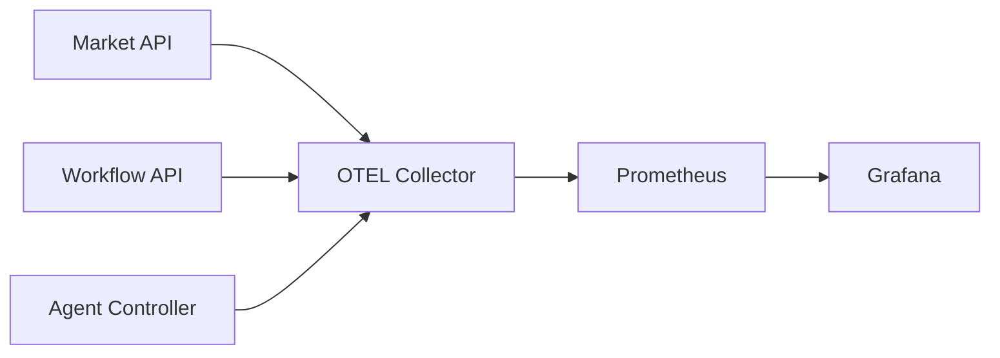

# 09 — Observabilité, Résilience et SLO

## 1. Pourquoi observer une décision et pas seulement un pod ?

Une plateforme agentique peut être techniquement `Running` tout en produisant une mauvaise décision, un conflit non détecté ou une latence excessive. L’observabilité doit couvrir à la fois le **runtime** et le **workflow métier/IA**.

## 2. Les trois piliers

### Metrics

Mesures agrégées dans le temps : taux d’erreur, latence, nombre de décisions, veto, reviews, exécutions simulées, consommation CPU/mémoire.

### Logs

Événements détaillés permettant le diagnostic. Ils doivent inclure corrélation/workflow_id sans exposer de secrets.

### Traces

Chaîne causale d’un appel à travers plusieurs services. OpenTelemetry fournit le modèle commun de télémétrie.

## 3. Architecture observabilité

Grafana est l’interface SRE/technique ; le Web Cockpit est l’interface métier/démonstration.

## 4. Golden signals

Pour chaque service :

- **Latency** ;
- **Traffic** ;
- **Errors** ;
- **Saturation**.

Pour l’IA/decision plane, ajouter :

- taux `SUPPORTED/UNKNOWN/CONFLICT/VETO` ;
- nombre `REVIEW_REQUIRED` ;
- délai de revue humaine ;
- taux approve/reject ;
- nombre SHADOW/PAPER ;
- retrieval quality/RAG failures ;
- tool call failures/timeouts.

## 5. SLI, SLO, SLA

- **SLI** : mesure réelle, ex. p95 latency.
- **SLO** : objectif interne, ex. 99,5 % de disponibilité.
- **SLA** : engagement contractuel avec conséquence éventuelle.

TradeOps documente des SLO techniques mais ne prétend pas fournir un SLA commercial.

## 6. Résilience stateless

Un service stateless doit pouvoir être supprimé puis recréé sans perte de vérité métier. La persistance est externalisée.

Le laboratoire a déjà testé la suppression contrôlée d’un pod `agent-controller` avec récupération en environ 14 secondes sous une cible pré-déclarée de 30 secondes.

## 7. RTO et RPO

- **RTO** : durée maximale acceptable avant reprise du service.
- **RPO** : quantité de données maximale acceptable à perdre.

Pour un composant stateless sans état durable local, le RPO local peut être non applicable, mais il faut toujours analyser les dépendances stateful.

## 8. Stateful resilience

PostgreSQL, Qdrant et Redpanda nécessitent en production :

- stockage persistant ;
- sauvegarde/restauration ;
- réplication ;
- tests de recovery ;
- objectifs RPO/RTO ;
- stratégie de panne de zone/région.

Le CRC mono-nœud ne démontre pas ces propriétés de production.

## 9. Patterns de résilience

- timeout ;
- retry borné avec backoff ;
- circuit breaker lorsque pertinent ;
- bulkhead/isolation ;
- idempotence ;
- dead-letter handling ;
- graceful degradation ;
- health/readiness/startup probes.

Un retry sans idempotence peut aggraver une panne ou produire un double effet.

## 10. Failure modes agentiques

La résilience IA ne se limite pas aux crashs :

- réponse LLM invalide ;
- contexte RAG vide ;
- data stale ;
- tool timeout ;
- conflit entre agents ;
- modèle indisponible ;
- reviewer absent ;
- état expiré.

Chaque cas doit avoir un comportement explicite, généralement fail-closed.

## 11. Evidence

Une preuve de résilience doit enregistrer :

- hypothèse et cible avant test ;
- timestamp ;
- action injectée ;
- état avant/après ;
- temps de récupération ;
- perte de données observée ;
- limites de mesure.

Le principe est identique à la CI : **une assertion sans evidence n’est pas un résultat de validation**.
