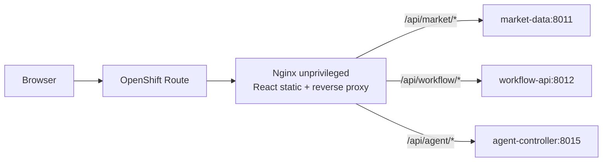

# 11 — TradeOps Web Cockpit

## 1. Rôle

Le Web Cockpit est l’interface métier/démonstration. Il ne remplace ni les APIs ni Grafana.

- **Cockpit** : compréhension métier, décision, HITL, audit.
- **Grafana** : observabilité SRE/technique.
- **Swagger/OpenAPI** : contrat et diagnostic API.
- **OpenShift Console** : runtime et ressources cluster.

## 2. Architecture



Le navigateur ne reçoit aucune route directe vers MCP, PostgreSQL, Qdrant, Redpanda ou Prometheus.

## 3. Pourquoi un reverse proxy same-origin ?

Il permet :

- une origine navigateur unique ;
- moins de complexité CORS ;
- aucun besoin d’exposer chaque backend ;
- contrôle de la surface réseau ;
- URLs stables côté frontend ;
- possibilité d’ajouter headers/politiques au point d’entrée.

Le pattern ressemble à un **BFF léger**, sans réimplémenter la logique métier.

## 4. Vues fonctionnelles

### Cockpit

Contexte marché, cartes instruments, signal, entry, stop, targets, R/R, régime, pattern et score ML qualifié.

### Agent Evidence

Présente les contributions Market, Technical, Pattern, Macro, RAG, ML et les états de preuve.

### HITL

Création d’une proposition, revue `APPROVE/REJECT` et exécution gouvernée `SHADOW/PAPER`.

### Performance

Outcomes de démonstration marqués `DEMO_SYNTHETIC`. Ils ne constituent pas une performance financière réelle.

### Audit

Lecture du vrai endpoint `/audit` du Workflow API.

### Platform

Liens vers Agent Swagger, Workflow Swagger, Grafana et OpenShift Console.

## 5. Provenance visuelle

L’IHM doit toujours distinguer :

- valeur issue d’une API réelle ;
- valeur synthétique/démo ;
- estimation ;
- mesure réellement observée.

Cette distinction est une propriété d’architecture de confiance, pas seulement un détail UI.

## 6. Sécurité frontend

- aucun secret compilé ;
- tokens Agent/Reviewer saisis explicitement ;
- conservation uniquement en mémoire React pour le lab ;
- CSP et security headers ;
- NetworkPolicy egress dédiée ;
- aucune possibilité de real-money execution.

## 7. Packaging OpenShift

- React + TypeScript + Vite ;
- Dockerfile multi-stage ;
- Nginx unprivileged compatible arbitrary UID ;
- ImageStream `tradeops-ui` ;
- BuildConfig ;
- image `tradeops-ui:i13-ui` ;
- Helm Deployment + Service + Route ;
- probe `/healthz`.

## 8. Etat LIVE CRC

Vérifié le 2026-09-13 :

- `tradeops-ui-1` : `Complete` ;
- image digest publiée ;
- Helm release `tradeops`, revision 5 ;
- Deployment `1/1` ;
- Route `https://tradeops-ui-tradeops.apps-crc.testing` ;
- `/` HTTP 200 ;
- `/healthz` HTTP 200 ;
- `/api/market/health` HTTP 200 ;
- `/api/workflow/health` HTTP 200 ;
- `/api/agent/health` HTTP 200 ;
- `I9_CRC_VERIFY_PASS`.

## 9. Ce qui reste avant « CRC métier end-to-end »

La plateforme UI est LIVE. Reste à capturer la preuve interactive :

```text
proposal -> REVIEW_REQUIRED -> human APPROVE/REJECT ->
SHADOW/PAPER -> audit record
```

Cette limite est documentée volontairement ; elle évite de confondre disponibilité technique et validation métier complète.

## 10. URL catalogue

Le catalogue canonique des URLs est `docs/28-demo-urls.md`. Les statuts `LIVE`, `INTERNAL`, `PLANNED` et `REFERENCE` évitent les démonstrations ambiguës.
