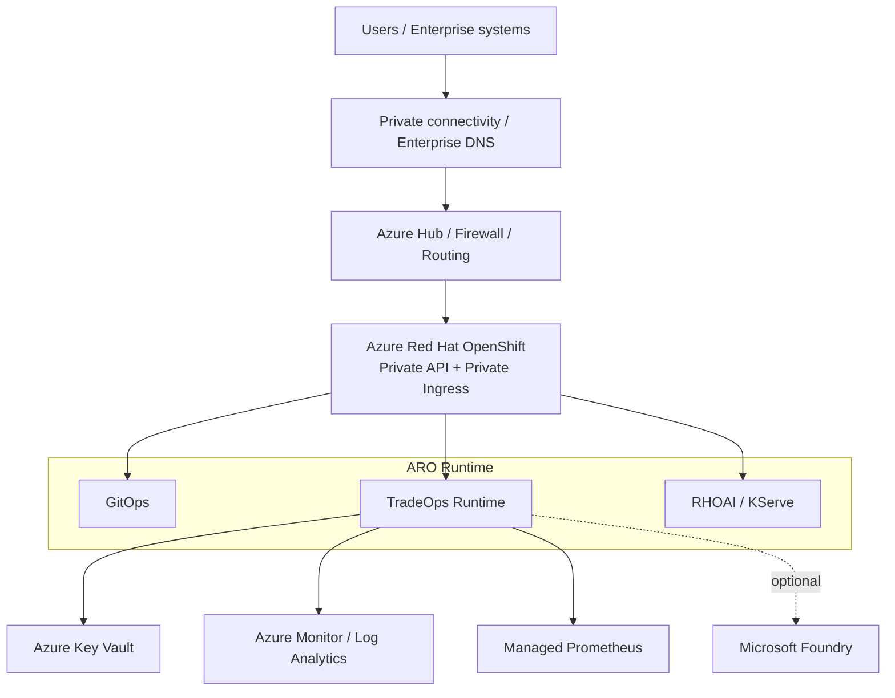
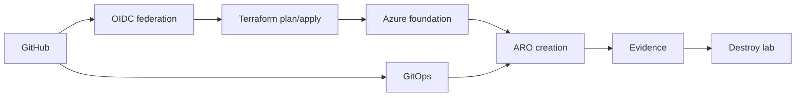

# 12 — Azure / ARO Enterprise Target

## 1. Objectif

Transposer TradeOps du lab OpenShift local vers Azure **sans changer les contrats cœur**. La cible est **ARO-first** afin de préserver OpenShift, GitOps, RHOAI/KServe et les patterns de sécurité déjà démontrés.

Statut : **TARGET / NON DEPLOYED**.

## 2. Topologie cible

## 3. Pourquoi ARO plutôt qu’AKS ?

Pour ce programme, la valeur architecturale est de conserver :

- contrats OpenShift ;
- Routes/Operators/RBAC ;
- GitOps ;
- RHOAI/KServe ;
- modèle de déploiement déjà validé sur CRC.

Choisir AKS imposerait une transposition supplémentaire sans besoin fonctionnel démontré.

## 4. Réutilisation Azure

Le programme réutilise les principes du dépôt `mayabank-azure-cloud-ai-platform` :

- Landing Zone / hub-spoke ;
- Entra / PIM / RBAC ;
- Key Vault ;
- managed/workload identity ;
- Azure Monitor/OpenTelemetry ;
- FinOps/GreenOps ;
- discipline destroy des labs.

Il adapte le runtime : ARO remplace l’orientation AKS du repo de référence.

## 5. Identité

### Provisioning

ARO utilise des managed identities.

### Workloads

Les applications utilisent workload identity / federated credentials pour accéder aux services Azure.

Principe : **pas de client secret longue durée dans Git ou dans les manifests**.

## 6. Secrets

Key Vault cible :

- Azure RBAC ;
- purge protection ;
- public network access désactivé ;
- private endpoint ;
- droits least privilege via workload identity.

## 7. Réseau

Cible entreprise : private-by-default.

- subnets master ;
- subnets workers ;
- shared services ;
- DNS/routing intégrés à la Landing Zone ;
- ExpressRoute/VPN/firewall/egress inspection selon contexte entreprise.

Un profil de lab temporaire peut utiliser API/ingress publics uniquement avec autorisation explicite et sans données sensibles. Ce profil ne redéfinit pas la cible production.

## 8. Observabilité Azure

Le contrat applicatif reste OpenTelemetry. Azure ajoute :

- Log Analytics ;
- Azure Monitor Workspace ;
- Managed Prometheus ;
- intégration ARO ;
- conservation des correlation IDs et trace context.

Ainsi la télémétrie applicative reste portable.

## 9. Microsoft Foundry

Foundry est **optionnel**. Il peut fournir des modèles/agents/outils managés, mais :

- ne remplace pas le Risk Gate ;
- ne contourne pas HITL ;
- ne remplace pas automatiquement RHOAI ;
- n’est pas créé dans le lab par défaut à cause des coûts/quotas.

## 10. IaC et industrialisation

Terraform prépare les ressources de fondation et les validations répétables.

Pipeline cible :

Les actions Azure coûteuses doivent rester derrière une approbation explicite et un cost gate.

## 11. DR

Une architecture deux régions est documentée comme pattern, mais aucun active/active n’est revendiqué. RTO/RPO, réplication de données et failover DNS doivent être mesurés avant statut VERIFIED.

## 12. Ce qui n’est pas encore prouvé

Le dépôt ne prétend pas encore avoir :

- un ARO en fonctionnement ;
- un apply Azure complet ;
- private DNS/ExpressRoute validés ;
- Key Vault workload identity prouvé live ;
- Managed Prometheus depuis un vrai ARO ;
- Foundry déployé ;
- coût/carbone Azure mesurés pour le lab ARO ;
- DR mesuré.

Le blocker correspondant reste `OPENSHIFT_AZURE_DEPLOYMENT`.
