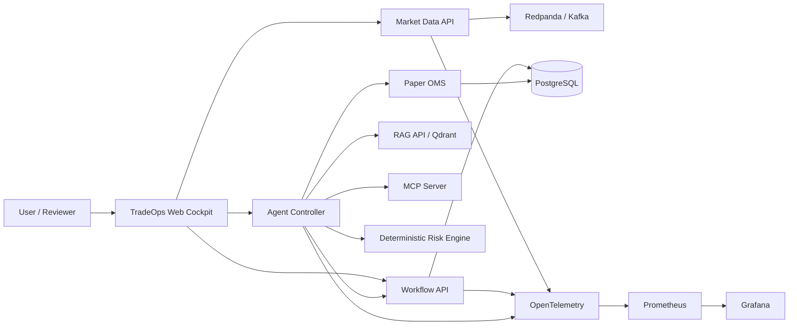

# TradeOps Architecture Wiki

> **Référence d’architecture : AI Solution Architect — Agentic AI & Real-Time Trading Systems**

Ce Wiki transforme le dépôt TradeOps en **dossier d’architecture démontrable**. Il explique à la fois les concepts, les choix d’architecture, leur implémentation dans le dépôt et leur niveau de preuve réel.

## Positionnement

TradeOps utilise le trading temps réel comme **domaine de référence exigeant**, mais les patterns restent transposables aux paiements, à la fraude, au risque, à la cybersécurité, à l’assurance et aux systèmes de décision temps réel.

Le principe directeur est :

```text
analysis -> deterministic evidence -> ML/GenAI enrichment ->
Risk Gate -> Human-in-the-Loop -> SHADOW/PAPER -> audit/evidence
```

L’exécution autonome avec argent réel est hors périmètre.

## Architecture en une vue



## Statuts utilisés dans ce Wiki

| Statut | Signification |
|---|---|
| **LIVE VERIFIED** | observé et validé sur le CRC réel |
| **IMPLEMENTED** | présent dans Git et validé par tests/CI |
| **DEMO/SYNTHETIC** | données ou résultats destinés à la démonstration |
| **PENDING LIVE PROOF** | implémenté mais preuve runtime complète manquante |
| **TARGET** | architecture cible future, non déployée |

## État au 2026-09-13

- Web Cockpit : **LIVE VERIFIED sur CRC**.
- Route IHM : `https://tradeops-ui-tradeops.apps-crc.testing`.
- `I9_CRC_VERIFY_PASS` : **PASS**.
- HITL complet `REVIEW_REQUIRED -> APPROVE/REJECT -> SHADOW/PAPER -> audit` : **PENDING LIVE PROOF**.
- Azure/ARO : **TARGET / NON DEPLOYED**.
- Graduation globale : encore bloquée par `OPENSHIFT_AZURE_DEPLOYMENT` et `RESILIENCE_FINOPS_GREENOPS_VERIFIED`.

## Parcours recommandé

1. [Vision, principes et frontières](01-Vision-et-Principes.md)
2. [C4 et architecture logique](02-C4-et-Architecture-Logique.md)
3. [Architecture applicative et services](03-Architecture-Applicative-et-Services.md)
4. [Agentic AI, RAG et MCP](04-Agentic-AI-RAG-MCP.md)
5. [Risk Gate, Fusion et Human-in-the-Loop](05-Risk-Fusion-HITL.md)
6. [EDA, Data, ML, Replay et Backtesting](06-EDA-Data-ML-Replay.md)
7. [Sécurité et Zero Trust](07-Securite-Zero-Trust.md)
8. [OpenShift, CRC, GitOps et RHOAI](08-OpenShift-CRC-GitOps-RHOAI.md)
9. [Observabilité, Résilience et SLO](09-Observability-Resilience-SLO.md)
10. [FinOps et GreenOps](10-FinOps-GreenOps.md)
11. [Web Cockpit](11-Web-Cockpit.md)
12. [Azure / ARO target](12-Azure-ARO-Target.md)
13. [ADR, patterns et anti-patterns](13-ADR-Patterns-AntiPatterns.md)
14. [Demo runbook et evidence](14-Demo-Runbook-Evidence.md)
15. [Glossaire des concepts](15-Glossaire-Concepts.md)

## Sources de vérité du dépôt

Le Wiki synthétise et explique les artefacts existants sous `docs/`, `services/`, `infra/`, `gitops/`, `scripts/`, `schemas/` et `evidence/`. Pour les preuves runtime, le Wiki ne remplace jamais les fichiers sous `evidence/` : ceux-ci restent la source de vérité opérationnelle.
